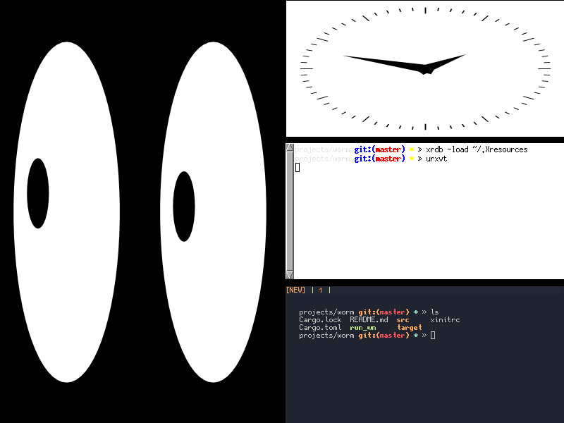

# worm
<b>w</b>or<b>m</b> X window manager using Rust and XCB

## Goals
* Tiling, floating, and monocle modes
    * Similar to dwm, with master and stacking area
    * Tiling mode support for overiding default with preselection similar to bspwm
* Reparenting to support title bars and other window decorations
    * Support window gaps as well, i3-gaps breaks here
* Multiple workspace and multimonitor support
